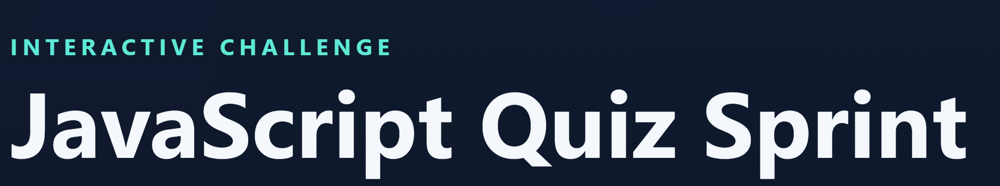
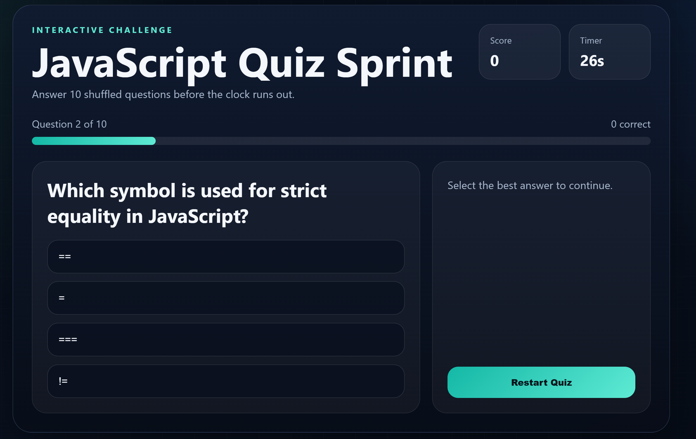
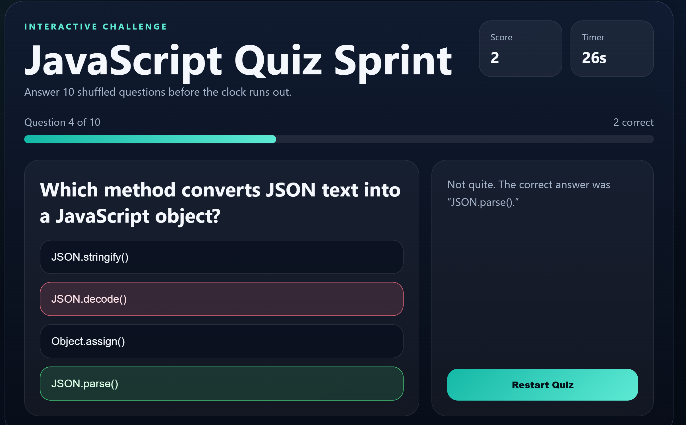
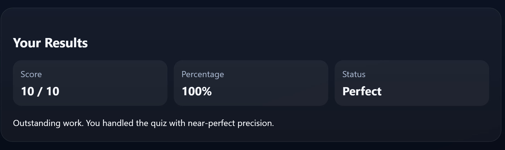

# JavaScript Quiz Sprint

> A lightweight browser quiz for learners who want a quick, timed practice on core JavaScript concepts.



---

## 🔴 Live Demo

🔗 [View Live](https://sakhiur2022.github.io/quiz-app/)

---

## 📸 Screenshots

| Question View                              | Answer Selected                            |
| ------------------------------------------ | ------------------------------------------ |
|  |  |

| Results Screen                             |
| ------------------------------------------ |
|  |

---

## ✨ Features

- Timed 10-question challenge (30s per question) with auto-advance on timeout
- Questions and options are shuffled each attempt; score and progress are tracked
- Immediate correct/wrong highlighting, feedback, and a results summary with percentage

---

## 🛠️ Built With


---

## 🚀 Getting Started

```bash
# Clone the repo
git clone https://github.com/Sakhiur2022/quiz-app.git

# Open in browser
open index.html
```

No dependencies. No build step.

---

## 📁 Project Structure

```
├── index.html
├── style.css
├── app.js
└── screenshots/
    ├── answer-selected.png
    ├── banner.png
    ├── question-view.png
    └── results-screen.png
```

---

## 🤝 Connect

**Sakhiur** · [LinkedIn](https://www.linkedin.com/in/sakhiur/) · [Portfolio](https://sakhiur.vercel.app)

---

## 📄 License

[MIT](LICENSE)
